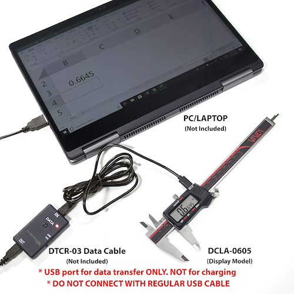
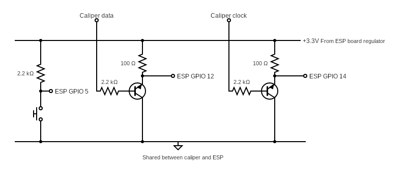

# VINCA Reader

  

This project replaces the VINCA `DTCR-03` "RS232" Digital Caliper Data Transfer Cable with a WiFi enabled ESP8266/ESP32.

  

The VINCA `DCLA-0605` Caliper only supports data transfer to a computer over a proprietary cable.

  

You _could_ buy a USB adapter, but that's no fun. I decided to reverse engineer the "RS232" and implement my own solution.

  
  

## Decoding the Serial Protocol

  

The connector is a USB micro, so I cut down a cable and started looking at the lines with an oscilloscope. It was easy to identify that the D+ and D- lines have clock and data. Since it has a clock, that means it's a synchronous protocol, even though Amazon says it's RS232. I wrote a Python script to extract the 24 bits being sent at 150ms intervals and record them to a CSV. Then I spent a lot of time trying to understand the data by trying to fit it to all the floating point standards I could find, but nothing worked. Eventually, I got it to work as a fixed point[^1] with the extra 4 bit for flags. One flag represents units (inch / mm), and the other represents the sign (negative when `1`).

  

[^1]: After I finished the project, I came across an old blog post that explains the bit format. It's a lot simpler, just number of distance units, number of 0.01mm or 0.0005" depending on the units used. I updated the code accordingly. The blog can be found here: https://www.yuriystoys.com/2013/07/chinese-caliper-data-format.html.

  

## Hardware

  

Once I understood the protocol, I was ready to work on the hardware for my solution. I wanted to use the ESP platform so I can send the data over wifi, but the serial data is at 1.2v and the ESP runs at 3.3v. I started looking at level shifters, but most of the online designs are based on the 2N7000 MOSFET, but 1.2v wasn't enough to trigger the gate. I was looking at MOSFET with lower VGS trigger voltage, but I didn't want to use a special part. Eventually, I've realized I can just use a 2N2222 bi-polar transistor. I'll lose the MOSFET performance, but it'll be more than enough for digital `1` and `0` levels.

  

## Software

  

The UI is an Excel style interface that allows collecting and naming measurements.

The main display is constantly updated via WebSocket. 

Measurements can be inserted with a button or using the spacebar.

  

The Web UI is compressed and stored on the ESP flash. I used a library I maintain for other IoT projects which provides features like:

  

1. Web server with `/wifi` page to set the wifi credentials.

2. Access point mode, when booting and the last stored wifi network is not in range.

3. mDNS publish of the HTTP service so you don't need to find the IP, you can just use [http://vinca_reader.local/](http://vinca_reader.local/).

4. OTA programming.

  

## Support for Other Hardware

  

There are three separate adapters for VINCA products:

1. `DTCR-03` for Digital calipers

2. `DTCR-02` for Clockwise Tools calipers 

3. `DTCR-01` for Clockwise Tools Digital Indicators

  

All of these use a micro USB as the connector, but there were some other differences when I compared against the `DIGR-0105` 1" Digital Indicators: 

  

1. The +5v line on the indicator is connected to 1.5v, but on the caliper it's not connected.

2. The time period between the serial bursts is shorter on the indicator.

  

It was very easy to add support for both, and I'm assuming other models may work or will need slight modifications.

  
  
  

||
|:-------------------------:|
|Adapter in use over WiFi powered from an external battery| 

||
|:-------------------------:|
|Adapter in use over WiFi powered directly by the tablet connected to a digital indicator| 

  

The original cable from Clockwise Tools identifies as a usb keyboard and types the measurement when you press the button. With the ESP32-S2 we can have this functionality as well. (The ESP8266 doesn't have a native USB support).

  
||
| :----------------------------------------: |
| Google sheets on android with the adapter connected as a usb keyboard|

  
